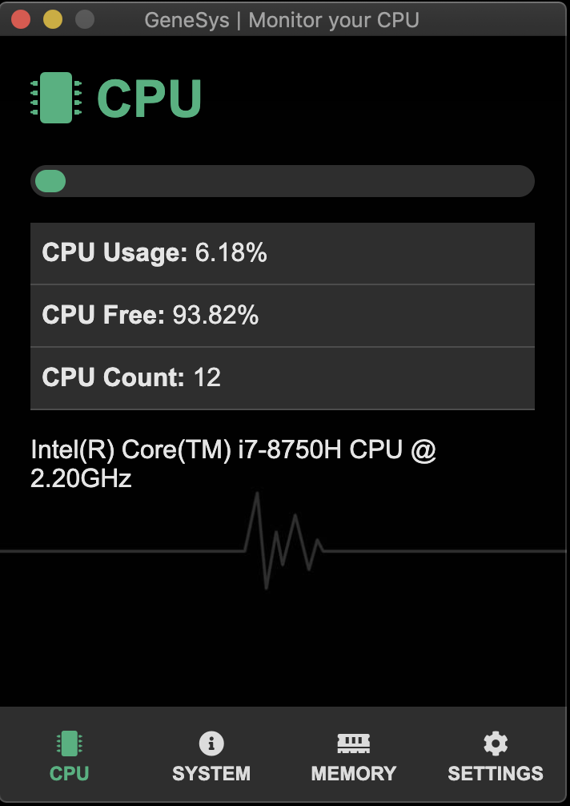

# GeneSys | Monitor your CPU

## **Description**

GeneSys is a new desktop application for CPU and system monitoring. This app offers valuable information about the CPU, as well as information about the current operating system and memory usage. You can modify in the settings tab the limit percentage of CPU usage and the frequency of alert notifications, in case the usage percentage passes the set limit.

## **Features**

- *CPU* tab: information about the current CPU usage percentage, CPU free percentage, CPU count and CPU model
- *System* tab: information about the computer name, OS & Original OS, system uptime and IP address
- *Memory* tab: information about system used & free memory and driver used & free memory
- *Settings* tab: options to set the CPU Overload warning percentage and the alert frequency in minutes
- Values set in the settings tab are stored as user settings and stay the same between app sessions
- Displayed values for most CPU & System info are updated every 2 seconds
- Even if the app window is closed, the app continues to run in the background, until the user explicitly right-clicks on the app tray icon and clicks "Quit"

## **How to Contribute**

1. Clone repo and create a new branch: `$ git checkout https://github.com/FromZeroToCicero/GeneSys -b name_for_new_branch`.
2. Make changes and test
3. Submit Pull Request with comprehensive description of changes

## **Acknowledgements**

- [@Brad Traversy - TraversyMedia](https://www.traversymedia.com/) for the Electron from Scratch course and starting codebase.
- [Official Electron Documentation](https://www.electronjs.org/docs) for being a guide in developing the finer parts of the application.
